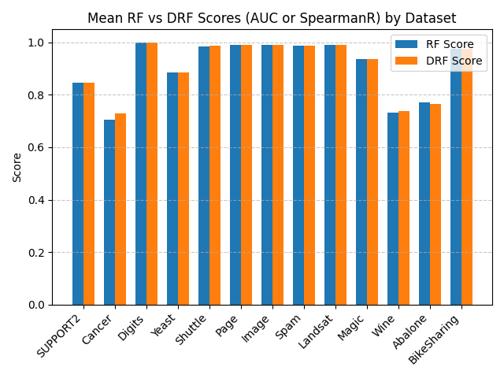

# Double Random Forest (Python Implementation)

This repository contains a Python/C++ implementation of the Double Random Forest (DRF) algorithm as described in:

> Han, S., Kim, H. & Lee, YS. (2020). Double random forest. *Machine Learning*, 109, 1569–1586. https://doi.org/10.1007/s10994-020-05889-1

## About Double Random Forest

Double Random Forest is an ensemble learning method that improves upon traditional random forests by:
1. Using double bootstrap sampling to create training sets
2. Employing random subspace selection twice for feature selection
3. Combining predictions through weighted voting

This approach has been shown to improve prediction accuracy while maintaining the benefits of traditional random forests.

## Installation

### Prerequisites
- A C++ compiler
- Python 3.8+

### Installation Steps

1. Clone the repository:
   ```bash
   git clone https://github.com/gkoundry/double_random_forest.git
   cd double_random_forest
   ```

2. Install build requirements and package:
   ```bash
   pip install -r requirements_build.txt
   pip install -e .
   ```

## Documentation

### DoubleRandomForest Classes

The `DoubleRandomForestRegressor` class implements the Double Random Forest algorithm for regression tasks.
The `DoubleRandomForestClassifier` class implements the Double Random Forest algorithm for both binary and multiclass classification tasks.

### Parameters

| Parameter | Type | Default | Description |
|-----------|------|---------|-------------|
| `n_estimators` | int | 100 | Number of trees in the forest |
| `max_depth` | int or None | None | Maximum depth of the trees. If None, nodes are expanded until all leaves are pure. |
| `max_features` | str or int | 'sqrt' | Number of features to consider at each split or 'sqrt' for square root of total features. |
| `min_samples_leaf` | int | 1 | Minimum number of samples required to be at a leaf node. |
| `random_state` | int or None | None | Controls randomness of bootstrapping and feature selection |

### Key Methods

### `fit(X, y)`

Train the Double Random Forest model on input data.

```python
drf.fit(X_train, y_train)
```

**Parameters:**
- `X` : array-like of shape (n_samples, n_features)
  Training input samples
- `y` : array-like of shape (n_samples,)
  Target values (class labels or regression targets)

**Returns:**
- `self` : object
  Fitted estimator

### `predict(X)`

Predict class labels or regression values for input samples.

```python
predictions = drf.predict(X_test)
```

**Parameters:**
- `X` : array-like of shape (n_samples, n_features)
  Input samples to predict

**Returns:**
- `predictions` : array of shape (n_samples,)
  Predicted class labels or regression values

### `predict_proba(X)`

Predict class probabilities for input samples (classification only).

```python
probabilities = drf.predict_proba(X_test)
```

**Parameters:**
- `X` : array-like of shape (n_samples, n_features)
  Input samples to predict

**Returns:**
- `probabilities` : array of shape (n_samples, n_classes)
  Class probabilities for each sample

## Example Usage

```python
import numpy as np
from double_random_forest import (
    DoubleRandomForestRegressor,
    DoubleRandomForestClassifier,
)

# Create test data
X = np.random.rand(100, 10)
y_reg = np.sum(X, axis=1) + np.random.rand(100) * 0.1
y_binary = (y_reg > np.median(y_reg)).astype(int)
y_multiclass = np.digitize(y_reg, bins=np.percentile(y_reg, [25, 50, 75]))

# Train and test the Double Random Forest regressor
drf_reg = DoubleRandomForestRegressor(n_estimators=10)
drf_reg.fit(X, y_reg)
print("Double Random Forest Regressor Predictions:", drf_reg.predict(X))

# Train and test the Double Random Forest binary classifier
drf_clf_binary = DoubleRandomForestClassifier(n_estimators=10)
drf_clf_binary.fit(X, y_binary)
print("Double Random Forest Binary Classifier Predictions:", drf_clf_binary.predict(X))
print(
    "Double Random Forest Binary Classifier Probabilities:",
    drf_clf_binary.predict_proba(X),
)

# Train and test the Double Random Forest multiclass classifier
drf_clf_multiclass = DoubleRandomForestClassifier(n_estimators=10)
drf_clf_multiclass.fit(X, y_multiclass)
print(
    "Double Random Forest Multiclass Classifier Predictions:",
    drf_clf_multiclass.predict(X),
)
print(
    "Double Random Forest Multiclass Classifier Probabilities:",
    drf_clf_multiclass.predict_proba(X),
)
```

## Benchmarking

To reproduce the benchmark results:

1. Install benchmark requirements:
   ```bash
   pip install -r requirements_bench.txt
   ```

2. Run the benchmark:
   ```bash
   python benchmark.py
   ```

### Benchmark Results



## Contact

For questions or suggestions, please contact:
- Glen Koundry
- Email: gkoundry@gmail.com
- GitHub: [@gkoundry](https://github.com/gkoundry)
